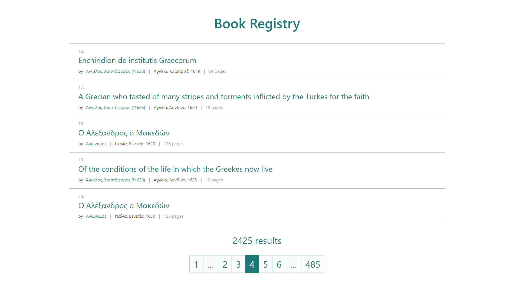

# Book Registry Demo App

React App displaying a list of available books fetched from [nyx.vima.ekt.gr/api/books](http://nyx.vima.ekt.gr:3000/api/books) API

### Author

Lukasz Przewlocki

## Screenshot

## Tech used

- React
- React Router
- React Bootstrap
- TypeScript
- SCSS modules
- basic Enzyme (+ RTL) unit tests

## TODO

- more and more robust unit tests
- smoother transitions between pages
- better styling

## Available Scripts

In the project directory, you can run:

### `yarn start`

Runs the app in the development mode. 
Open [http://localhost:3000](http://localhost:3000) to view it in the browser.

The page will reload if you make edits. 
You will also see any lint errors in the console.

### `yarn test`

Launches the test runner in the interactive watch mode. 
See the section about [running tests](https://facebook.github.io/create-react-app/docs/running-tests) for more information.

### `yarn build`

Builds the app for production to the `build` folder. 
It correctly bundles React in production mode and optimizes the build for the best performance.

The build is minified and the filenames include the hashes. 
Your app is ready to be deployed!
